# 🏆 SHADE Implementation Master Plan — Path to 1st Place

## Strategic Alignment (The Four Pillars)
Based on *"The Four Pillars of a First-Place Hackathon Win: A Strategic Blueprint for the FortyGuard Global AI Challenge"*:

1. **Mission Alignment**: "The Silent Killer of Our Time" (Jay Sadiq). Moving from passive heat maps to an active **Temperature Co-Pilot** (Temperature Operating System — tOS).
2. **Human Experience & Heat Equity**: Grounded in Mike Stelfox's principle (*"What Temperature Means for the Human Experience"*). CDC Social Vulnerability Index (SVI) integration, prioritizing high-risk residents (elderly, low-income, outdoor workers in Maryvale vs Arcadia).
3. **Hyperlocal Precision (20 m² @ 2 m height)**: Every calculation explicitly modeled at the 2-meter pedestrian plane where humans experience heat and where FortyGuard collects data.
4. **Predictive AI & Production-Grade Ecosystem**: Powered by Large Temperature Models (LTMs) for 24h predictive planning, NVIDIA NIM (Llama-3.1-70b), Triton Inference Server, and QGIS/GeoJSON + Bilingual SMS municipal deliverables.

---

## 6-Layer Implementation Roadmap

```mermaid
graph TD
    subgraph L1_Data["Layer 1: Data & Synthetic Engine"]
        D1[FortyGuard Async Client]
        D2[Phoenix 20m² Grid Generator]
        D3[CDC SVI & Census Tract Joiner]
        D4[Canopy & Albedo Surface Data]
    end

    subgraph L2_Analytics["Layer 2: Deterministic Math Engine"]
        A1[HERI Engine: Z-score + SVI + Canopy]
        A2[APS Calculator: Vulnerability Multipliers]
        A3[CES Ranker: ROI per $ spent]
        A4[Predictive LTM Diurnal Cycle Engine]
    end

    subgraph L3_L4_Opt["Layer 3 & 4: Inference & Optimization"]
        I1[Surrogate Model ONNX + Physics Fallback]
        I2[Dual-Layer Cooling Matrix: 2m Air + MRT]
        O1[Spatial Knapsack Solver]
        O2[Gaussian Overlap Diminishing Returns]
    end

    subgraph L5_Agent["Layer 5: Agentic Decision Engine"]
        AG1[LangGraph StateGraph Workflow]
        AG2[4 Specialized Decision Tools]
        AG3[NVIDIA NIM Llama-3.1-70b Integration]
        AG4[Flagship Demo Trajectory Engine]
    end

    subgraph L6_UI["Layer 6: 3D Twin & God Mode UI"]
        U1[Deck.gl 3D Extruded Prisms & 20m² Mesh]
        U2[2m Pedestrian Plane Visualizer]
        U3[Before/After Dual-Mode Cooling Slider]
        U4[God Mode Monospace Terminal Console]
        U5[QGIS Work Order & Bilingual SMS Exporters]
    end

    L1_Data --> L2_Analytics
    L2_Analytics --> L3_L4_Opt
    L3_L4_Opt --> L5_Agent
    L5_Agent --> L6_UI
```

---

## Execution Phases

### Phase 1: Core Mathematical & Data Engines (L1 & L2)
- Fully implement `synthetic_grid.py` with 2,500+ realistic cells for Maryvale (33.49°N, -112.18°W) and Arcadia (33.50°N, -111.95°W).
- Implement realistic spatial attributes: surface albedo, building height-to-width ratio, NDVI canopy cover, and CDC SVI tract scores.
- Fully implement `heri.py`, `aps.py`, `ces.py`, and `forecast.py` with verifiable math.

### Phase 2: ML Surrogate & Spatial Optimization Engine (L3 & L4)
- Train the PyTorch neural network surrogate model on physics data and export `model.onnx`.
- Implement `surrogate_model.py` with ONNX runtime inference and physics fallback.
- Implement `knapsack.py` and `overlap.py` with spatial distance kernel for diminishing returns.

### Phase 3: LangGraph Agent & NVIDIA NIM (L5)
- Wire real data flow into all 4 agent tools in `tools.py`.
- Build the LangGraph `graph.py` with agent state, tool routing, and streaming output.
- Configure `nim_client.py` and `demo_mode.py` for flawless execution of the flagship Maryvale elderly prompt.

### Phase 4: API Routers & Exporters
- Implement all FastAPI endpoints in `backend/api/` with real computation and error handling.
- Implement `exporters/geojson.py` (QGIS-ready with styling properties) and `exporters/sms.py` (English + Spanish alerts).

### Phase 5: Frontend 3D Twin & God Mode Console (L6)
- Wire Deck.gl layers (HexagonLayer, GeoJsonLayer, PolygonLayer for 2m plane).
- Implement interactive Before/After slider with Air Temp ↔ MRT/Perceived toggle.
- Polish God Mode Console with quick-prompts, animated tool call badges, and markdown deployment summaries.

### Phase 6: Automated Verification & Unit Tests
- Execute full test suite (`pytest`) on math, surrogate inference, and knapsack optimization.
- Verify end-to-end API responses via test scripts.
