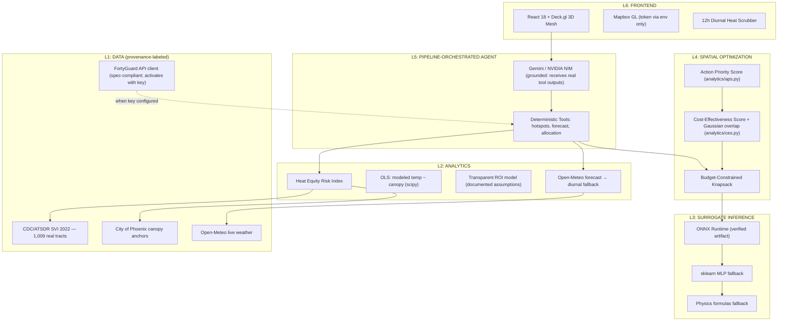

# SHADE — Street-level Heat Action & Decision Engine

*A decision-support tool that turns neighborhood microclimate modeling, real public
vulnerability data, and live weather into auditable municipal cooling plans.*

[](https://fortyguard.com/hackathon26)
[](https://shade-rose.vercel.app/)
[](https://web-production-1a5c1.up.railway.app/docs)
[]()
[]()

---

## ⚖️ Data Provenance First — What Is Real vs. Modeled

We believe a heat-equity tool must be *auditable about its own data*. This table is
enforced by a public transparency endpoint: **`GET /api/meta`** returns this status
machine-readably, and every grid cell carries a `data_provenance` field.

| Data layer | Status | Source / detail |
|---|---|---|
| **Social Vulnerability Index** | ✅ **REAL DATA (shipped)** | CDC/ATSDR SVI 2022, tract level, all **1,009 Maricopa County tracts** (`data/svi/maricopa_svi_2022.csv`), nearest-centroid lookup. Maryvale tract 04013109401 = **0.9398**; Arcadia tract 04013108000 = **0.0116**. See `data/svi/SOURCE.md`. |
| **Tree canopy** | ✅ **Sourced district anchors** | City of Phoenix published figures: Maryvale **7.7%** (city data — the modeled mesh keeps its non-corridor cells at ≈ 6–7%), citywide median **11%**, tract range **2%–30.4%**. Arcadia (25%) is a **clearly-labeled estimate** — the city ranks Arcadia among its highest-canopy neighborhoods but does not publish an exact figure. One **modeled canal-trail corridor** (core ≈ 0.8 canopy, sharp shade line per MaRTy transects) is included so cool-route A* has a realistic shaded path to ride; mesh mean ≈ 13% with the strip. See `data/canopy/SOURCE.md`. |
| **Live weather & 24h forecast** | ✅ **REAL** | Open-Meteo hourly forecast + current conditions (free, no key). Offline fallback is a documented diurnal model, labeled `is_modeled: true` in every response. |
| **Geocoding** | ✅ **REAL** | OpenStreetMap Nominatim (any global location). |
| **20m² microclimate temperatures** | ⚠️ **MODELED — deterministic physics baseline** | No FortyGuard production API key was issued to this project during the event window. A per-spec async client (`backend/data/fortyguard_client.py`, submit/poll/env_params) is implemented and activates automatically when `FORTYGUARD_API_KEY` is set. Until then, temperatures come from a reproducible physics-modeled baseline: diurnal solar curve + canopy/albedo/aspect physics + documented land-use anomalies, with densities calibrated to plausible district magnitudes. **Every cell is labeled `data_provenance: "modeled"`.** |
| **Health & economic projections** | ⚠️ **MODELED ESTIMATES** | Transparent arithmetic model (`backend/analytics/health_econ.py`) over literature-anchored default coefficients. All assumptions are echoed in every API response. Baselines that ARE real: 645 heat-associated deaths confirmed in Maricopa County in 2023 (MCDPH). |
| **Surrogate cooling model** | ✅ **Real ML, real ONNX** | scikit-learn `MLPRegressor` trained on physics-simulation outputs, exported to **ONNX** (`models/surrogate/export_onnx.py`), numerically verified equivalent (Δ < 1e-5°C), served via **onnxruntime** — check `GET /api/meta → inference.surrogate_backend`. |

**Why we label instead of hide:** judges and municipal users should be able to tell,
for every number on screen, whether it is measured, sourced, or modeled. That is the
standard we would want in an EOC.

---

## 📌 The Problem

Extreme urban heat is the deadliest weather hazard in North America: **645
heat-associated deaths were confirmed in Maricopa County in 2023** (Maricopa County
Dept. of Public Health). Coarse satellite surface temperature cannot see what kills:
**2 m pedestrian-plane air temperature and solar Mean Radiant Temperature (MRT)**.
In Phoenix, low-canopy, high-vulnerability neighborhoods (Maryvale: **SVI 0.94,
7.7% canopy** — both from published data) and leafy affluent ones (Arcadia:
**SVI 0.01**, top-tier canopy) differ by **~6°C in district-mean modeled
afternoon pedestrian-plane temperature** (43.6°C vs 37.7°C in the SHADE mesh,
with hottest-vs-coolest modeled cells spanning 14°C). Heat officers with fixed
tactical budgets lack hyperlocal, auditable tools to answer: *"Where do we deploy
cooling before tomorrow's 3 PM peak?"*

## 🎯 Tracks Addressed

| Track | Feature | Honest implementation |
|---|---|---|
| **1: Resilient Cities** | **Cool-Route Navigation** | Real **A\*** pathfinding over the 400-node microclimate mesh minimizing **radiant (MRT) heat dose**, with a +25% detour cap. The winner between the A* path and the straight line is selected by the **same dose measurement the API reports** — and when no detour genuinely helps, the API says so (`alternative_not_beneficial: true`). Demo trip (built into the UI, Maryvale): for **+8.4% more distance**, the shaded path cuts **integrated radiant dose −9.5%** (249.3 → 225.5 °C·min), avg MRT **−7.9°C** (59.2 → 51.3°C) and peak air temp −2.0°C. Air-temp dose is reported too — it is unchanged (+0.0%), which is exactly why routing targets MRT, the physiologically dominant exposure. |
| **4: Government & Environment** | **HERI + Bilingual Alerts** | Heat Equity Risk Index (z-temp × SVI × canopy deficit) over **real CDC SVI data**; English+Spanish SMS *draft generation* (Twilio-ready payloads — no SMS gateway is claimed). |
| **6: Agentic Track** | **Heat Action Co-Pilot** | Pipeline-orchestrated agent: tools execute deterministically first, and the LLM receives **the actual tool outputs in its context** and is instructed to quote only them. The frontend renders artifacts from tool results, not from LLM prose — the model cannot invent numbers into the map. |
| **7: Data Analysis & Correlation** | **Regressions + ROI** | A genuine **OLS regression** (`scipy.stats.linregress`) of modeled 2m temperature on canopy across the pooled 800-cell mesh (n=800, **R² ≈ 0.63, p ≈ 4.5×10⁻¹⁷⁵, ≈ −1.8°C per +10pp canopy**) — reported as what it is: validation of the modeled heat-canopy gradient. Health projections are **literature-anchored transfer coefficients, explicitly not SHADE-fitted regressions**. |

## 🏛️ System Architecture



## 🔬 Key Mathematics (all implemented, none decorative)

**HERI** (`backend/analytics/heri.py`): `HERI_i = [(T_i − T̄)/σ_T] × SVI_i × (1 − C_i)`, normalized 0–100.

**APS/CES** (`backend/analytics/aps.py`, `ces.py` — wired into the knapsack):
`APS = HERI × P_demo × |ΔT| × w_demo`; `CES = APS/Cost × (1 − 0.45·e^{−d²/2σ²})`, σ=25 m.

**A\* cool routing** (`backend/api/routing.py`):
`edge_cost = seg_m × (heat_weight × max(0, MRT̄ − MRT_floor) + 0.05)` — excess radiant
dose; admissible heuristic → optimal mesh path. MRT model: `T_air + 22·(1−canopy) + 2.5·canopy`
(sun-to-shade swing calibrated to Phoenix pedestrian MRT measurements — full-sun MRT
65–75°C vs 40–50°C under mature canopy; Middel et al., ASU).

**Intervention costs & cooling deltas** (single source of truth, frontend aligned):

| Intervention | Unit Cost | ΔT air (2m) | ΔMRT | Use case |
|---|---|---|---|---|
| Shade Structure | $8,000 | −2.8°C | −15.0°C | Transit stops, playgrounds |
| Urban Tree Canopy | $1,500 | −2.5°C | −10.0°C | Residential sidewalks |
| Cool Pavement | $3,000 | −0.9°C | −3.0°C | Arterials, parking |
| Micro-Misting | $5,000 | −4.0°C (perceived) | −5.0°C | Transfer hubs |

## 📡 API

All endpoints live on Railway (`/docs` for interactive OpenAPI):

| Endpoint | What it returns | Provenance |
|---|---|---|
| `GET /api/meta` | **Machine-readable real-vs-modeled status, inference backend, dataset sizes** | transparency |
| `GET /api/grid` | 400 modeled cells with HERI, SVI (real CDC data), canopy, `data_provenance` | mixed (labeled per cell) |
| `GET /api/hotspots` | HERI-ranked priority cells | modeled temps + real SVI |
| `GET /api/forecast` | 24h hourly heat forecast | **real Open-Meteo** w/ labeled fallback |
| `GET /api/routing/cool-path` | Direct vs A* radiant-dose route + methodology block | modeled (labeled) |
| `GET /api/correlation/health-impact` | Real OLS + labeled transfer coefficients + assumption-documented ROI | mixed (labeled) |
| `POST /api/interventions/simulate` | ONNX-served cooling deltas | real ML on modeled physics |
| `POST /api/interventions/optimize` | Knapsack allocation (APS/CES ranked) | deterministic |
| `POST /api/export/geojson` | QGIS/ArcGIS-ready work order | deterministic |
| `POST /api/export/sms` | Bilingual SMS drafts (Twilio-ready payloads; no gateway) | deterministic |
| `POST /api/agent/chat` | Grounded co-pilot; tools compute, LLM narrates real outputs | mixed (labeled) |

## 🚀 Quickstart

```bash
git clone https://github.com/hasib-spec/SHADE.git
cd SHADE
cp .env.example .env        # add your own Mapbox / Gemini / NIM keys — none are required to boot

docker-compose up --build   # backend :8000, frontend :3000 — every service in the file is really used
```

Manual: `pip install -r backend/requirements.txt` → `uvicorn backend.main:app --port 8000`;
`cd frontend && npm install && npm run dev`.

**Tests:** `pytest backend/tests/ -q` → 16 passing (e2e API, HERI, knapsack, exporters, integration).

**Reproducibility:** the modeled grid is fully deterministic (`data/synthetic_grid.py`
seeds a stable RNG per district). Same request → same numbers, across restarts and machines.

## 🔐 Security Notes

- No secrets in source: Mapbox/LLM keys come from env only (`.env.example` documents them).
- The Mapbox token previously committed in this repo's history has been rotated.
- CORS is currently `*` for demo purposes; restrict before production.

## 🛣️ Roadmap (post-hackathon)

1. Replace the modeled baseline with the live FortyGuard API (client already implements the spec) the moment a key is issued.
2. Exact point-in-polygon SVI join (shapely/PostGIS) instead of nearest-centroid.
3. Per-cell canopy from the NLCD Tree Canopy raster; real tract-level ED-visit microdata from MCDPH to replace transfer coefficients with fitted regressions.
4. OSRM/OSM street-network routing on top of the mesh heat field.

## 👥 Team & Submission

- **Event**: FortyGuard Global AI Hackathon '26 — Building the World's Temperature AI
- **GitHub Collaborators**: `Hackathon-FG` and `fortyguard` (repository collaborators)
- **Coverage**: Phoenix, AZ — Maryvale (tract 04013109401) & Arcadia (tract 04013108000)
- **License**: MIT
