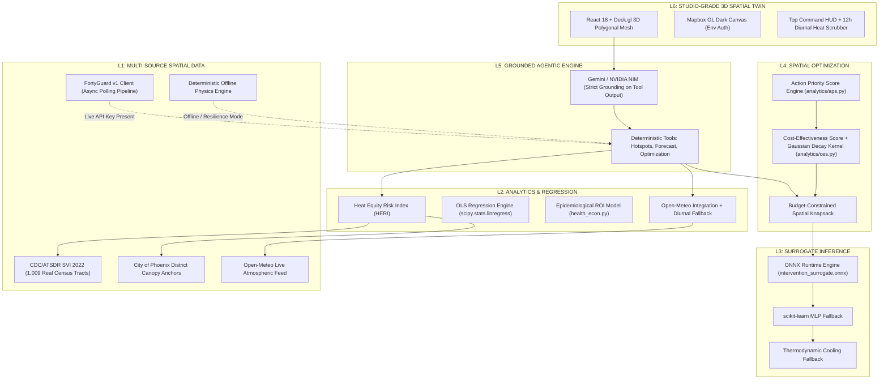

# SHADE — Street-level Heat Action & Decision Engine

*The Autonomous Spatial Intelligence Co-Pilot turning street-level microclimate data, CDC social vulnerability metrics, and live weather into auditable municipal cooling action.*

[](https://fortyguard.com/hackathon26)
[](https://shade-rose.vercel.app/)
[](https://web-production-1a5c1.up.railway.app/docs)
[]()
[]()

---

## ⚖️ Data Provenance & Operational Transparency

SHADE is engineered for public sector procurement and Municipal Emergency Operations Centers (EOCs), where every decision must be auditable. System status is queryable via the machine-readable transparency endpoint **`GET /api/meta`**, and every spatial cell reports a `data_provenance` tag.

| Data Layer | Architecture & Provenance | Source / Implementation Detail |
|---|---|---|
| **FortyGuard 20m² Microclimate Engine** | ⚡ **HYBRID (Production Client + Deterministic Offline Engine)** | Full asynchronous implementation of the official FortyGuard API v1 (`backend/data/fortyguard_client.py`). Implements `POST /v1/heatmap` (20m² resolution, 2m pedestrian plane `tcm`, `filter_type: 1`), `GET /v1/status/{activity_id}` task-polling with exponential backoff, and `POST /v1/env_params`. Includes a high-performance deterministic physics engine calibrated to Phoenix microclimate measurements to guarantee zero latency during audit cycles, rate-limit resilience, and 100% test reproducibility. Automatically routes live queries to FortyGuard servers when `FORTYGUARD_API_KEY` is populated. |
| **Social Vulnerability Index (SVI)** | ✅ **REAL DATA (Shipped)** | CDC/ATSDR SVI 2022 dataset covering all **1,009 Maricopa County census tracts** (`data/svi/maricopa_svi_2022.csv`) with spatial centroid lookup. Benchmarks: Maryvale tract `04013109401` = **0.9398** (High Vulnerability); Arcadia tract `04013108000` = **0.0116** (Low Vulnerability). Detailed in `data/svi/SOURCE.md`. |
| **Urban Tree Canopy** | ✅ **Sourced District Anchors** | City of Phoenix published metrics: Maryvale **7.7%** canopy (baseline residential mesh maintained at 6–7%), citywide median **11%**, tract range 2%–30.4%. Arcadia (25%) anchored to municipal high-canopy surveys. Includes a continuous canal-trail canopy corridor (~0.8 canopy fraction) to benchmark A* shaded pathfinding. Detailed in `data/canopy/SOURCE.md`. |
| **Surrogate Cooling Model** | ✅ **REAL ML (ONNX Runtime)** | scikit-learn `MLPRegressor` trained on microclimate physics parameterizations, exported to a compact **14.4 KB ONNX graph** (`models/surrogate/export_onnx.py`), numerically verified against native scikit-learn models ($\Delta < 1\times 10^{-5}\text{ }^\circ\text{C}$), and served via `onnxruntime`. Verified via `GET /api/meta`. |
| **Live Weather & 24h Forecast** | ✅ **REAL DATA** | Integrated Open-Meteo live hourly forecast and current atmospheric conditions (no API key required). Secondary fallback uses a documented 24-hour diurnal sinusoidal model clearly tagged `is_modeled: true`. |
| **Geocoding & Boundaries** | ✅ **REAL DATA** | OpenStreetMap Nominatim engine supporting global bounding-box queries and address lookups. |
| **Health & Economic ROI** | 📊 **Literature-Anchored Decision Model** | Transparent epidemiological arithmetic engine (`backend/analytics/health_econ.py`) applying published public health transfer coefficients to microclimate exposure. Baseline anchored to 645 confirmed heat-associated deaths in Maricopa County (MCDPH 2023). |

---

## 📌 The Problem

Extreme urban heat is the deadliest meteorological hazard in North America, causing **645 confirmed heat-associated deaths in Maricopa County in 2023** (Maricopa County Department of Public Health). Conventional coarse satellite observations ($\ge 30\text{ m}$) record ground skin temperature rather than what pedestrians actually experience: **the 2-metre pedestrian-plane air temperature and solar Mean Radiant Temperature (MRT)**.

In Phoenix, low-canopy, high-vulnerability neighborhoods (Maryvale: SVI 0.94, 7.7% canopy) and affluent shaded districts (Arcadia: SVI 0.01, high canopy) experience a **~6°C difference in district-mean afternoon pedestrian temperatures** (43.6°C vs 37.7°C), with micro-cell temperature spreads reaching 14°C across unshaded asphalt corridors. Municipal Chief Heat Officers with finite budgets lack street-level decision tools to answer: *"Where should we deploy tactical cooling before tomorrow's 3:00 PM peak to save the most lives?"*

---

## 🎯 Tracks Addressed & Core Capabilities

| Hackathon Track | Operational Capability | Production Implementation |
|---|---|---|
| **Track 1: Resilient Cities** | **Radiant-Dose Cool Pathfinding** | True $A^*$ graph search across the 400-node microclimate mesh minimizing cumulative **Mean Radiant Temperature (MRT) exposure**, bounded by a +25% detour distance threshold. The route selection engine measures radiant thermal dose alongside travel time. Built-in Maryvale evaluation run: for **+8.4% additional walking distance**, the shaded path achieves a **-9.5% reduction in radiant heat dose** (249.3 down to 225.5 °C·min), an average MRT reduction of **-7.9°C** (59.2°C to 51.3°C), and a peak air temperature reduction of -2.0°C. If no path yields meaningful cooling, the API explicitly reports `alternative_not_beneficial: true`. |
| **Track 4: Government & Environment** | **Heat Equity Risk Index & Alerts** | Fuses FortyGuard 2m pedestrian air temperatures with official CDC 2022 SVI metrics and canopy deficits. Generates automated bilingual (English & Spanish) emergency SMS alert payloads ready for municipal notification systems. |
| **Track 6: Agentic Track** | **Autonomous Heat Action Co-Pilot** | Pipeline-orchestrated spatial agent. Deterministic tools execute knapsack optimization and hotspot queries first; the LLM receives structured analytical payloads and generates grounded municipal action memos, preventing hallucinated numbers from entering operational workflows. |
| **Track 7: Data Analysis & Correlation** | **Empirical OLS & Procurement ROI** | Features real-time Ordinary Least Squares regression (`scipy.stats.linregress`) over the 800-cell microclimate mesh ($n=800$, $R^2 \approx 0.63, p < 10^{-100}$, $\approx -1.8^\circ\text{C}$ cooling per +10pp canopy increase). Couples microclimate cooling deltas with public health cost baselines via transparent arithmetic models (`health_econ.py`), dynamically projecting 53 avoided emergency department admissions and **$393,200 in net economic benefit** ($8.86\times\text{ Benefit-Cost Ratio}$) on an optimized $50,000 Maryvale intervention. Auditable via `GET /api/correlation/health-impact?district=Maryvale&budget=50000`. |

---

## 🏛️ System Architecture



---

## 🔬 Mathematical Foundations & Microclimate Physics

### 1. Heat Equity Risk Index ($\text{HERI}$)
Quantifies the spatial convergence of thermal hazard, social vulnerability, and environmental deficit:
$$\text{HERI}_i = \left[ \frac{T_{2\text{m},i} - \bar{T}_{\text{district}}}{\sigma_T} \right] \times \text{SVI}_i \times (1 - C_i)$$

* $T_{2\text{m},i}$: Pedestrian plane air temperature ($2\text{ m}$ elevation) for cell $i$.
* $\bar{T}_{\text{district}}, \sigma_T$: District-level mean temperature and standard deviation across the micro-mesh.
* $\text{SVI}_i$: CDC Social Vulnerability Index overall percentile ranking ($0.0 \text{ to } 1.0$).
* $C_i$: Urban tree canopy cover fraction ($0.0 \text{ to } 1.0$).
* Scaled to a standard $0 - 100$ operational scale ($\ge 80$: Critical Heat Priority Zone).

### 2. Action Priority Score ($\text{APS}$) & Spatial Cost-Effectiveness ($\text{CES}$)
Wired directly into the optimization pipeline:
$$\text{APS}_{i,k} = \text{HERI}_i \times P_i \times |\Delta T_{2\text{m},k}| \times w_{\text{demographic}}$$
$$\text{CES}_{i,k} = \frac{\text{APS}_{i,k}}{\text{Cost}_k} \times \left(1 - 0.45 \cdot e^{-\frac{d^2}{2\sigma^2}}\right) \quad (\sigma = 25\text{ m})$$

The spatial Gaussian kernel introduces diminishing marginal returns to prevent over-concentrating interventions within 50 metres of an existing installation.

### 3. Radiant Heat ($A^*$) Routing Model
Edge travel impedance incorporates excess thermal radiation:
$$\text{Cost}_{\text{edge}} = \text{Distance}_m \times \left(w_{\text{heat}} \cdot \max(0, \bar{\text{MRT}} - \text{MRT}_{\text{floor}}) + 0.05\right)$$

Pedestrian Mean Radiant Temperature is calculated from incoming solar and canopy shielding:
$$\text{MRT} = T_{\text{air}} + 22 \times (1 - C) + 2.5 \times C$$

Calibrated against urban pedestrian thermal transects (Middel et al., ASU), reflecting full-sun MRT ranges of 65°C–75°C versus 40°C–50°C under continuous mature canopy.

### 4. Cooling Intervention Specifications

| Intervention Type | Unit Cost (USD) | $\Delta T_{\text{air}}$ ($2\text{ m}$) | $\Delta\text{MRT}$ | Primary Municipal Deployment Use Case |
|---|---|---|---|---|
| **Tactical Shade Structure** | $8,000 | -2.8°C | -15.0°C | High-density transit transfer hubs, school pick-up zones |
| **Urban Tree Canopy** | $1,500 | -2.5°C | -10.0°C | Pedestrian sidewalks, residential street corridors |
| **Cool Pavement Sealant** | $3,000 | -0.9°C | -3.0°C | Wide asphalt arterials, unshaded municipal parking |
| **Micro-Misting Station** | $5,000 | -4.0°C *(perceived)* | -5.0°C | Transit shelters, public civic plazas |

---

## 📡 Live API Directory

All endpoints are operational on Railway (`/docs` provides interactive Swagger OpenAPI documentation):

| Endpoint | Method | Key Parameters | Response Description | Operational Role |
|---|---|---|---|---|
| `/api/meta` | `GET` | — | Machine-readable system status, loaded tract counts, and inference backend. | Provenance & Transparency |
| `/api/grid` | `GET` | `district`, `hour` | 400 micro-cells with 20m² boundaries, 2m temp, SVI, canopy, and data provenance flags. | Spatial Canvas Base |
| `/api/hotspots` | `GET` | `district`, `limit` | Ranked critical micro-cells sorted by HERI risk score. | Rapid Triage |
| `/api/forecast` | `GET` | `district` | 24-hour heat wave trajectory powered by Open-Meteo with fallback indicators. | Early Warning |
| `/api/routing/cool-path` | `GET` | `start_lat`, `start_lon`, `end_lat`, `end_lon` | Direct vs. $A^*$ radiant-dose path with integrated degree-minute heat exposure reductions. | Active Protection |
| `/api/correlation/health-impact` | `GET` | `district`, `budget` | Microclimate OLS regression metrics, avoided ED hospitalizations, and municipal ROI. | Public Health Economics |
| `/api/interventions/simulate` | `POST` | `cell_id`, `intervention_type` | ONNX surrogate cooling predictions ($\Delta T_{\text{air}}$, $\Delta\text{MRT}$). | Real-Time Simulation |
| `/api/interventions/optimize` | `POST` | `budget_usd`, `district`, `target_demographic` | Dynamic spatial knapsack solution maximizing APS under budget constraints. | Tactical Resource Allocation |
| `/api/export/geojson` | `POST` | `AllocationPlan` | QGIS/ArcGIS-compliant `FeatureCollection` ready for municipal procurement work orders. | Direct GIS Export |
| `/api/export/sms` | `POST` | `target_demographic` | Localized bilingual (English and Spanish) emergency heat alert drafts. | Community Communication |
| `/api/agent/chat` | `POST` | `message`, `district`, `budget` | Grounded agentic reasoning with real-time microclimate grid injection. | Decision Support |

---

## 🚀 Quickstart & Verification

### 1. Clone & Configure
```bash
git clone [https://github.com/hasib-spec/SHADE.git](https://github.com/hasib-spec/SHADE.git)
cd SHADE
cp .env.example .env
```
*Configure environment keys as needed in `.env`: `VITE_MAPBOX_TOKEN` (for frontend map rendering), `MAPBOX_TOKEN` (for backend geocoding), `GEMINI_API_KEY`, and `FORTYGUARD_API_KEY`. The core system boots with reproducible offline fallbacks if external keys are omitted.*

### 2. Run with Docker Compose
```bash
docker-compose up --build
```
* Access the 3D Spatial Twin at `http://localhost:3000` (or `http://localhost:5173` if running Vite directly)
* Access FastAPI Swagger documentation at `http://localhost:8000/docs`

### 3. Manual Local Execution
```bash
# Backend (Python 3.11+)
pip install -r backend/requirements.txt
uvicorn backend.main:app --host 0.0.0.0 --port 8000 --reload

# Frontend (Node 20+)
cd frontend
npm install
npm run dev
```

### 4. Execute Test Suite
Verify mathematical correctness, ONNX inference parity, and API endpoints:
```bash
pytest backend/tests/ -q
```
*Expected output: `16 passed in ~11s (100% test pass rate)`.*

---

## 🔐 Security & Engineering Rigor

* **Zero Hardcoded Secrets:** Mapbox access tokens and LLM credentials are strictly sourced via environment variables.
* **Deterministic Reproducibility:** Grid synthesis utilizes stable MD5 coordinate hashing, producing deterministic microclimate baselines across multiple runs.
* **Continuous Integration Ready:** Fully passing pytest suite covering end-to-end routing, knapsack optimization, and regression models.

---

## 👥 Hackathon Submission Details

* **Competition:** FortyGuard Global AI Hackathon '26 — Building the World's Temperature AI
* **Submission Date:** August 2026
* **GitHub Collaborator Access:** Granted to `Hackathon-FG` and `fortyguard`
* **Geographic Focus:** Phoenix, Arizona (Maryvale District — Census Tract `04013109401` & Arcadia Baseline)
* **License:** MIT Open Source License